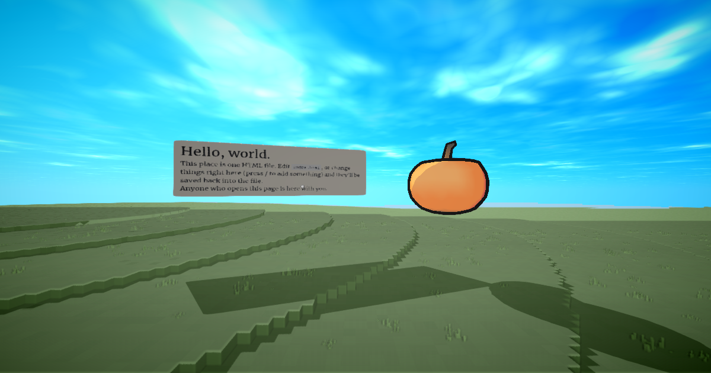

# Start a webspace

A webspace is a website whose pages can be **3D worlds you walk into with other people**, made of plain HTML.
This repository is a complete one: a single world in [`index.html`](index.html).

## Get your own in two minutes

1. Click **Use this template → Create a new repository** (top of this page).
2. In your new repo: **Settings → Pages → Build and deployment → Deploy from a branch → `main` / root → Save**.
3. Wait a minute, then open `https://<you>.github.io/<repo>/`. You're standing in your world. Send the link to a
   friend: they'll be there with you, with voice.

To edit it **in the world** and have your changes saved back to the repo, click **Save Changes** in the world
and connect it to GitHub with a [fine-grained token](https://github.com/settings/personal-access-tokens/new)
limited to this repository (Contents: read & write).

## Or work locally

Download this repository, open `index.html` in Chrome, and allow folder access when asked. Edits you make in
the world are saved straight into the file.

## Make it yours

Open `index.html`. It's short and commented:

- **`<meta>` tags** set the terrain, palette, and spawn point.
- **Every element in `<body>` is an object**: ``, `<video>`, `<model src="thing.svox|thing.glb|scan.spz">`,
  `<label>` text, emoji `
`s. `style="transform: translate3d(x, y, z)"` places it, in centimeters (y is up).
- **A `<script>`** can move things, react to clicks, and share state with everyone present, using only the DOM
  and a tiny `window.webspace` API.

The full reference, written for people and AI agents alike: **https://webspaces.space/llms.txt**

## Build it with an AI agent

This repo includes [`AGENTS.md`](AGENTS.md) and a Claude Code skill in [`.claude/skills/webspace`](.claude/skills/webspace/SKILL.md).
Open the folder in Claude Code (or Cursor, Codex, etc.) and ask for what you want:

> "Turn this into a moonlit koi pond: dark water, lanterns floating over it that drift slowly, and koi made of
> smooth voxels. Clicking a lantern lights it up for everyone."

## More

- Worlds to read and remix: https://webspaces.space/showcase/
- Engine: https://github.com/webspace-sdk/webspace-engine
